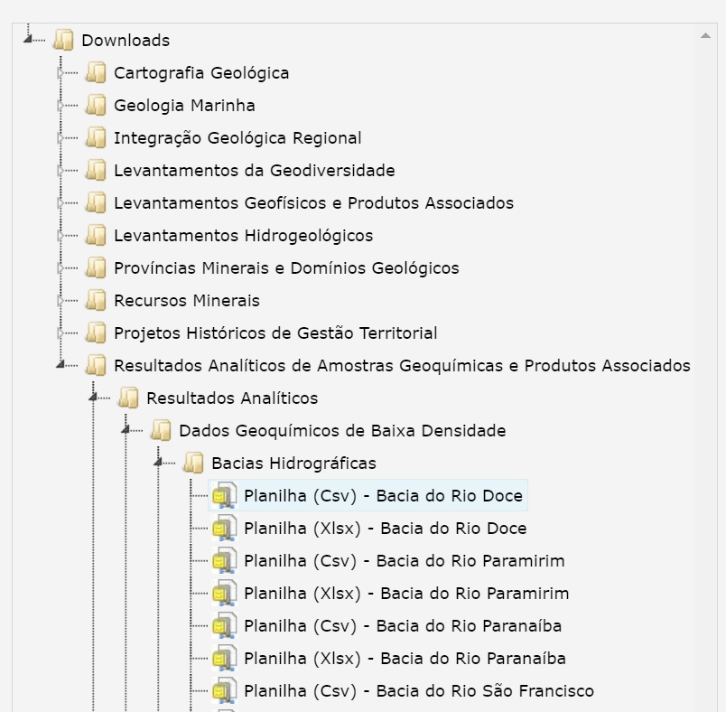
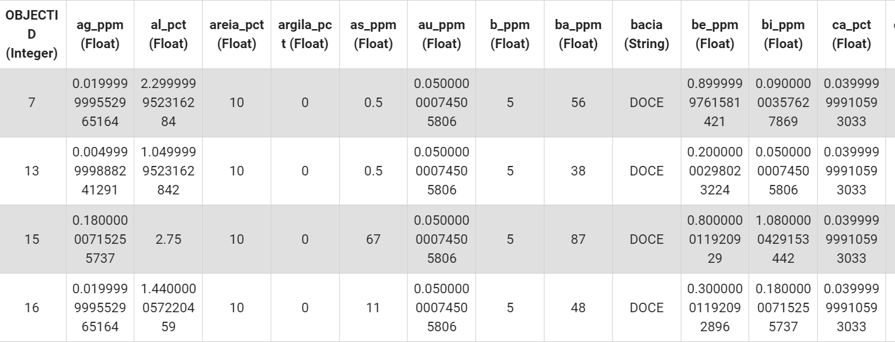

# Geochemical soil analyses 
## 1 - Introduction
:This paper explore a possibility to analyses geochemistry dataset of soil samples using [google earth engine](https://earthengine.google.com/). The google earth engine is a plataform that you can combine satellite images, javascript algorithms and real world applications, in your code plataform make it's possible up load any file. SO this exemple I will use a geochemistry dataset of soil samples avaiable free on the [Geological Survey of Brazil](https://geosgb.sgb.gov.br/geosgb/downloads.html), and you can do the same download, see the figure 1 to find easelly the Bacia_do_Rio_Doce.csv file. :
 

## 2 - Objectives
:This dataset has chemical analyses of different elements, like gold and cupper and other more, first we gonna plot that samples on Landsat 8 image, than we analyse the values of gold and cupper using data view technices avaiable on the plataform. The last part we gonna calculate index for cupper, the gossan index and create a Kringing interpolation to gold an cupper.:

## 3 - The Dataset
The dataset represent a collection of samples in a hidrographic Basin, in case Doce Basin, locate in Minas Gerais Province, Southeast of Brazil. It's has values of latitude and longitude, with the name of the basin  and the chemical values of each element analysed for sample.   
 
For this work is necessary use a SHP file (ESRI) that contains the geometry of all Brazilian Limits and the columns names and codes. We gonna extract the geometry of Doce Basin using this file. This file is avaiable [here](https://metadados.snirh.gov.br/geonetwork/srv/por/catalog.search#/metadata/f50527b9-24ed-41d5-b063-b5acfb25e10d) on Water Nacional Agency of Brazil. 

## 4 - Vizualising the dataset on G.E.E

First step is upload the datasets into GEE using the assets space to organize this documents, than let's start to code. Each dataset will be a varaible. The region of interest (roi) is the varaiable that store the shapefile, than let's select the cloumn to filter especifically the Rio Doce basin geometry. After, it's necessary to create a contour of the geometry, using a empty variable that represent a Image with no bytes, than let's paint the empty variable using the paint() function passing the roi as a feature collection and determine the color and the width. 
Using the aggregate_array() function in a expecific column that conatins the name of all Basin, it's possible get the exactaly name of Rio doce Basin in the dataset. Knowing that the name of Rio doce Baisn is Doce, let's apply a filter() function in roi FeatureCollection, and this filter is boolean filter that's we needs to choice the column tha has the name of the basins and the other parameter is the value that wants to filter, in this case, "Doce". The result of this filter is store in doce_basin variable, and now let's create a empty image using the doce_basin variable as FeatureCollection and do the same process applied to the roi FeatureCollection contour. To finish this part let's plot on the map using the Map.addLayer() function. 

To execute this first step just following the script bellow.

```
// Set the region (roi)

var roi = ee.FeatureCollection("users/contatobetterdecisions/GEOFT_DNAEE_SUBBACIA")
            
// Filter selection --  Get the name of rio deoce basin  == Doce
var data_value = roi.aggregate_array('DNS_NM')
print('All basins', data_value)

// Select Doce Basin

var doce_basin = roi.filter(ee.Filter.eq("DNS_NM", "Doce"))


// Create a contour of all Hidrografic Basins
var empty = ee.Image().byte()
var contour = empty.paint({
  featureCollection: roi,
  color:1, 
  width:2
})


// Create a contour of Doce basin
var empty_doce = ee.Image().byte()
var contour_doce = empty_doce.paint({
  featureCollection: doce_basin,
  color:2, 
  width:2

// Add contour om map

Map.addLayer(contour, {palette:["blue"]}, "Hidrografic Basins of Brazil")
Map.addLayer(doce_basin,{},"Rio doce Basin" )
Map.addLayer(contour_doce, {palette:["red"]}, "Rio doce Basin")


})
```


