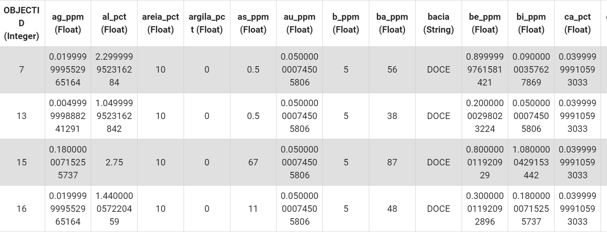

# Geochemical soil analyses 
## 1 - Introduction
This paper explore a possibility to analyses geochemistry dataset of soil samples using [google earth engine](https://earthengine.google.com/). The google earth engine is a plataform that you can combine satellite images, javascript algorithms and real world applications, in your code plataform make it's possible up load any file. SO this exemple I will use a geochemistry dataset of soil samples avaiable free on the [Geological Survey of Brazil](https://geosgb.sgb.gov.br/geosgb/downloads.html), and you can do the same download, see the figure 1 to find easelly the Bacia_do_Rio_Doce.csv file.  

## 2 - Objectives
This dataset has chemical analyses of different elements, like gold and cupper and other more, first we gonna plot that samples on Landsat 8 image, than we analyse the values of gold and cupper using data view technices avaiable on the plataform. The last part we gonna calculate index for cupper, the gossan index and create a Kringing interpolation to gold an cupper. 

## 3 - The Dataset

